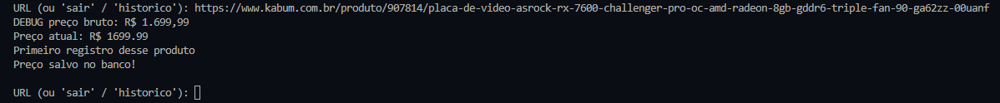
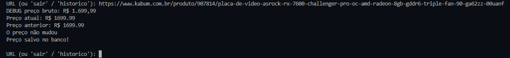
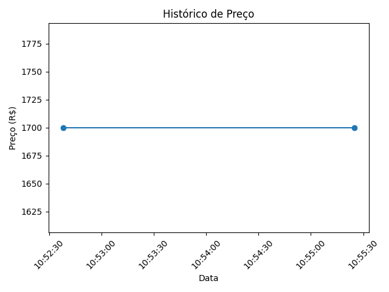

# Monitor de Preços (Price Tracker)

Projeto em Python para acompanhar o preço de produtos ao longo do tempo.

A partir do link de um produto, o programa acessa a página, coleta o preço atual, salva em um banco de dados e compara com registros anteriores para identificar variações.

---

## Demonstração

### Execução no terminal



---

### Exemplo de comparação de preços



---

### Gráfico de preços



---

## O que o projeto faz

* Acessa páginas de produtos automaticamente
* Extrai o preço utilizando Selenium
* Armazena os dados em um banco SQLite
* Compara o preço atual com o último valor registrado
* Mantém um histórico de preços

---

## Tecnologias utilizadas

* Python
* Selenium
* SQLite

---

## Como executar

1. Clone o repositório:

```bash
git clone https://github.com/seu-usuario/price-tracker.git
cd price-tracker
```

2. Crie um ambiente virtual:

```bash
python -m venv venv
venv\Scripts\activate
```

3. Instale as dependências:

```bash
pip install -r requirements.txt
```

4. Execute o programa:

```bash
python main.py
```

---

## Exemplo de saída

```bash
Preço atual: R$ 1699.99
Preço anterior: R$ 1799.99

O PREÇO CAIU!
Economia: R$ 100.00
```

---

## Observações

* Os seletores utilizados no scraping podem variar dependendo do site
* O banco de dados é criado automaticamente na primeira execução

---

## Próximos passos

* Implementar interface gráfica
* Gerar gráficos com evolução de preços
* Automatizar execução diária
* Criar sistema de notificações

---

## Autor

Projeto desenvolvido para portfólio.
